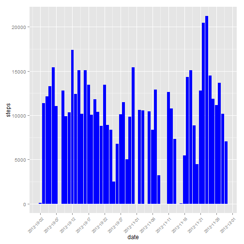
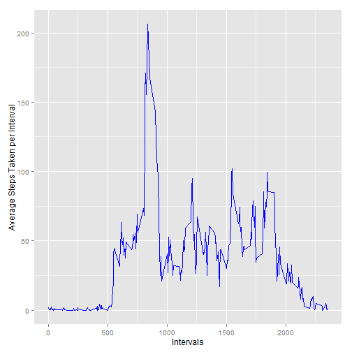
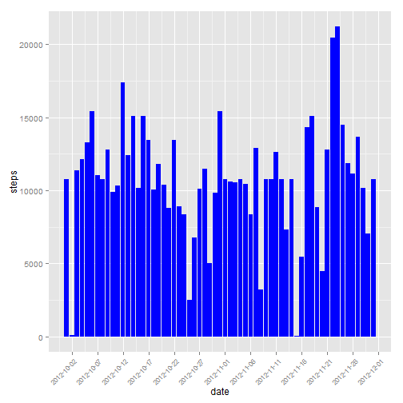
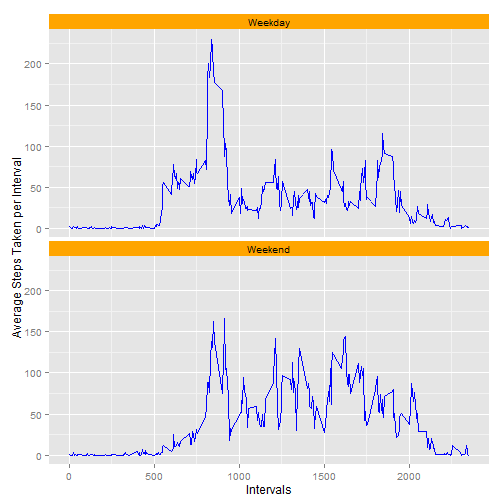

###Loading and preprocessing the data

So, let's start by loading and cleaning the data:

```r
Sys.setlocale("LC_ALL","English")
```

```
## [1] "LC_COLLATE=English_United States.1252;LC_CTYPE=English_United States.1252;LC_MONETARY=English_United States.1252;LC_NUMERIC=C;LC_TIME=English_United States.1252"
```

```r
data=read.csv("activity.csv")
data$date = as.Date(data$date, "%Y-%m-%d")
cleaned_data=na.omit(data)
```
Here I also convert the date variable into a date format.
I also change the locale to english in order for the weekdays() function to work smoothly

###What is mean total number of steps taken per day?

In this section I group the steps variable by the date and find the total number of steps for each day.

```r
library(ggplot2)
library(scales)
total_step_num = aggregate(steps ~ date, data=cleaned_data, sum)
total_step_num$date = as.Date(total_step_num$date, "%Y-%m-%d")
total_step_num = total_step_num[order(as.Date(total_step_num$date,format="%d-%m-%Y")),,drop=FALSE]
ggplot(total_step_num, aes(y=steps, x=date)) + geom_histogram(stat="identity",fill="blue") + theme(axis.text.x = element_text(size=8,angle = 45, vjust=1,hjust=1))+scale_x_date(breaks = "5 days", labels=date_format("%Y-%m-%d"))
```



So the total number of steps taken per day, the mean and the median are shown below:

```r
total_step_num$date=format(total_step_num$date,"%d-%m-%Y")
total_step_num
```

```
##          date steps
## 1  02-10-2012   126
## 2  03-10-2012 11352
## 3  04-10-2012 12116
## 4  05-10-2012 13294
## 5  06-10-2012 15420
## 6  07-10-2012 11015
## 7  09-10-2012 12811
## 8  10-10-2012  9900
## 9  11-10-2012 10304
## 10 12-10-2012 17382
## 11 13-10-2012 12426
## 12 14-10-2012 15098
## 13 15-10-2012 10139
## 14 16-10-2012 15084
## 15 17-10-2012 13452
## 16 18-10-2012 10056
## 17 19-10-2012 11829
## 18 20-10-2012 10395
## 19 21-10-2012  8821
## 20 22-10-2012 13460
## 21 23-10-2012  8918
## 22 24-10-2012  8355
## 23 25-10-2012  2492
## 24 26-10-2012  6778
## 25 27-10-2012 10119
## 26 28-10-2012 11458
## 27 29-10-2012  5018
## 28 30-10-2012  9819
## 29 31-10-2012 15414
## 30 02-11-2012 10600
## 31 03-11-2012 10571
## 32 05-11-2012 10439
## 33 06-11-2012  8334
## 34 07-11-2012 12883
## 35 08-11-2012  3219
## 36 11-11-2012 12608
## 37 12-11-2012 10765
## 38 13-11-2012  7336
## 39 15-11-2012    41
## 40 16-11-2012  5441
## 41 17-11-2012 14339
## 42 18-11-2012 15110
## 43 19-11-2012  8841
## 44 20-11-2012  4472
## 45 21-11-2012 12787
## 46 22-11-2012 20427
## 47 23-11-2012 21194
## 48 24-11-2012 14478
## 49 25-11-2012 11834
## 50 26-11-2012 11162
## 51 27-11-2012 13646
## 52 28-11-2012 10183
## 53 29-11-2012  7047
```

```r
mean(total_step_num$steps)
```

```
## [1] 10766.19
```

```r
median(total_step_num$steps)
```

```
## [1] 10765
```
As we can see the mean and the median are pretty close.

###What is the average daily activity pattern?

So here we must find the average steps taken per interval across all days.


```r
average_steps = aggregate(steps ~ interval,mean,data=cleaned_data)
ggplot(average_steps, aes(y=steps, x=interval)) + geom_line(col="blue") + ylab("Average Steps Taken per Interval") + xlab("Intervals")
```



Which 5-minute interval, on average across all the days in the dataset, contains the maximum number of steps?

```r
head(average_steps[order(average_steps$steps, decreasing = TRUE),])
```

```
##     interval    steps
## 104      835 206.1698
## 105      840 195.9245
## 107      850 183.3962
## 106      845 179.5660
## 103      830 177.3019
## 101      820 171.1509
```
As we can see, the interval 835 contains the maximum number of steps on average.

###Imputing missing values

In this section we calculate the number of rows with missing values

```r
missing_values = subset(data,is.na(steps))
nrow(missing_values)
```

```
## [1] 2304
```
So the total number of records with missing values is 2304.

In order to fill in all the missing values, I am going to use the mean of each interval.

```r
averaged_steps = aggregate(steps ~ interval, mean, data = cleaned_data)

filled_data = data
for(i in 1:nrow(data)){
 
      if(is.na(data[i,1])){
        filled_data[i,1] = subset(averaged_steps,interval==data[i,3])[,2]
      } 
  
}
```

The filled_data dataframe is identical with the original but with the average step number per interval instead of missing values.

So let's see the total number of steps taken each day in the filled data:

```r
total_step_num_filled = aggregate(steps ~ date, data=filled_data, sum)
total_step_num_filled$date = as.Date(total_step_num_filled$date, "%Y-%m-%d")
total_step_num_filled = total_step_num_filled[order(as.Date(total_step_num_filled$date,format="%d-%m-%Y")),,drop=FALSE]
ggplot(total_step_num_filled, aes(y=steps, x=date)) + geom_histogram(stat="identity",fill="blue") + theme(axis.text.x = element_text(size=8,angle = 45, vjust=1,hjust=1))+scale_x_date(breaks = "5 days", labels=date_format("%Y-%m-%d"))
```



And now let's calculate the filled data mean and median:


```r
total_step_num_filled$date=format(total_step_num_filled$date,"%d-%m-%Y")
total_step_num_filled
```

```
##          date    steps
## 1  01-10-2012 10766.19
## 2  02-10-2012   126.00
## 3  03-10-2012 11352.00
## 4  04-10-2012 12116.00
## 5  05-10-2012 13294.00
## 6  06-10-2012 15420.00
## 7  07-10-2012 11015.00
## 8  08-10-2012 10766.19
## 9  09-10-2012 12811.00
## 10 10-10-2012  9900.00
## 11 11-10-2012 10304.00
## 12 12-10-2012 17382.00
## 13 13-10-2012 12426.00
## 14 14-10-2012 15098.00
## 15 15-10-2012 10139.00
## 16 16-10-2012 15084.00
## 17 17-10-2012 13452.00
## 18 18-10-2012 10056.00
## 19 19-10-2012 11829.00
## 20 20-10-2012 10395.00
## 21 21-10-2012  8821.00
## 22 22-10-2012 13460.00
## 23 23-10-2012  8918.00
## 24 24-10-2012  8355.00
## 25 25-10-2012  2492.00
## 26 26-10-2012  6778.00
## 27 27-10-2012 10119.00
## 28 28-10-2012 11458.00
## 29 29-10-2012  5018.00
## 30 30-10-2012  9819.00
## 31 31-10-2012 15414.00
## 32 01-11-2012 10766.19
## 33 02-11-2012 10600.00
## 34 03-11-2012 10571.00
## 35 04-11-2012 10766.19
## 36 05-11-2012 10439.00
## 37 06-11-2012  8334.00
## 38 07-11-2012 12883.00
## 39 08-11-2012  3219.00
## 40 09-11-2012 10766.19
## 41 10-11-2012 10766.19
## 42 11-11-2012 12608.00
## 43 12-11-2012 10765.00
## 44 13-11-2012  7336.00
## 45 14-11-2012 10766.19
## 46 15-11-2012    41.00
## 47 16-11-2012  5441.00
## 48 17-11-2012 14339.00
## 49 18-11-2012 15110.00
## 50 19-11-2012  8841.00
## 51 20-11-2012  4472.00
## 52 21-11-2012 12787.00
## 53 22-11-2012 20427.00
## 54 23-11-2012 21194.00
## 55 24-11-2012 14478.00
## 56 25-11-2012 11834.00
## 57 26-11-2012 11162.00
## 58 27-11-2012 13646.00
## 59 28-11-2012 10183.00
## 60 29-11-2012  7047.00
## 61 30-11-2012 10766.19
```

```r
mean(total_step_num_filled$steps)
```

```
## [1] 10766.19
```

```r
median(total_step_num_filled$steps)
```

```
## [1] 10766.19
```

In this case we can see that filling up the missing values didn't affect the mean which is expected since we used the average step value to do the job. However there was a small change in the median which now has the same value as the mean.

###Are there differences in activity patterns between weekdays and weekends?

Here I will create the Weekday variable which will contain the values "Weekday" and "Weekend" indicating of course if the day is a weekday or not.

```r
filled_data$weekday="Weekday"
for(i in 1:nrow(filled_data)){
 
  
      if(weekdays(filled_data[i,2])=="Saturday"||weekdays(filled_data[i,2])=="Sunday"){
        filled_data[i,4] = "Weekend"
      } 
  
}
filled_data$weekday = as.factor(filled_data$weekday)
```


In this last part we compare the difference in activity between weekdays and weekends:

```r
weekday=aggregate(steps ~ interval,mean,data=subset(filled_data,weekday=="Weekday"))
weekend=aggregate(steps ~ interval,mean,data=subset(filled_data,weekday=="Weekend"))
weekday$weekday="Weekday"
weekend$weekday="Weekend"

full_week = rbind(weekday,weekend)
full_week$weekday=as.factor(full_week$weekday)

ggplot(full_week, aes(y=steps, x=interval, fill = weekday)) + geom_line(col="blue") + ylab("Average Steps Taken per Interval") + xlab("Intervals") + facet_wrap(~ weekday,ncol=1) + theme(strip.background = element_rect(fill="orange"))
```



As we can see, in weekends the activity seems ro be higher between the intervals 1000 and 1500 as well as around the interval 2000  while during weekdays the activity seems more intense during the intervals 750 - 1000


